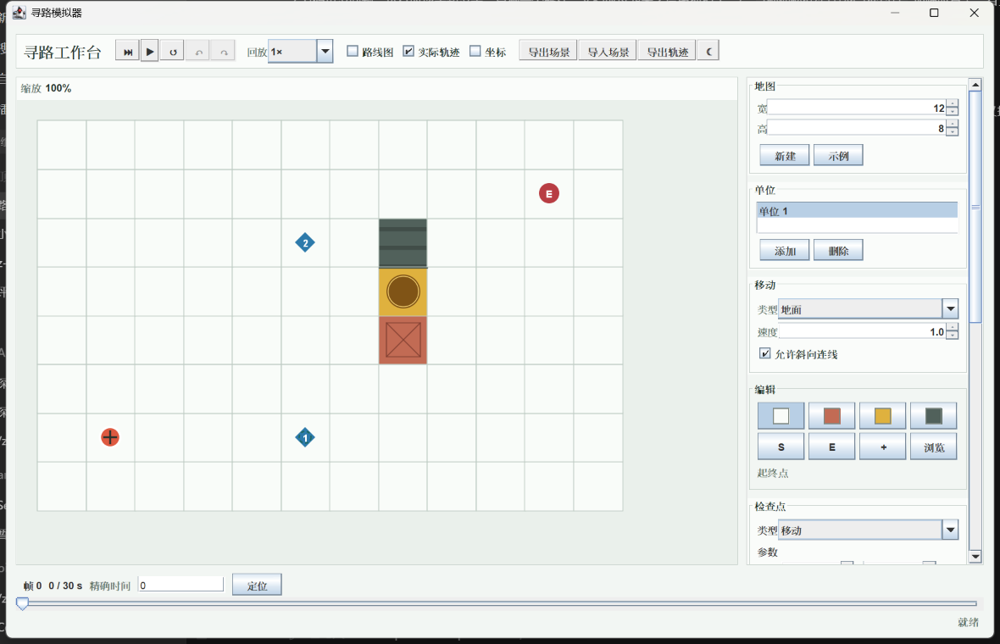

# 组件地图（Component Map）

每个可交互组件都有一个稳定编号，写在代码里（`ComponentIds.tag`），不会随界面改动漂移。

**最快的用法**：在模拟器窗口里**按住 Ctrl，把鼠标悬停在任何控件上**，旁边会弹出它的编号和中文名（蓝框高亮）。

报告问题时用这个三段式，把编号填进"在哪"：

```
在哪：C2（检查点坐标 Y）
现在：输入 5.1222 点击更新后变成 5.0
期望：原样保留四位小数
```

截图时把相关组件圈出来并标上编号，多个问题标 1、2、3。



## 地图与视图

| 编号 | 组件 | 说明 |
|------|------|------|
| M0 | 地图画布 | 中央地图区（点击放置、拖拽编辑、滚轮缩放） |
| D1 | 地图宽（格） | 「地图」区 |
| D2 | 地图高（格） | 「地图」区 |
| D3 | 新建地图 | 按 D1/D2 重建空地图 |
| D4 | 载入示例地图 | 内置演示场景 |
| V1 | 路线图开关 | 工具栏，显示规划路线 |
| V2 | 实际轨迹开关 | 工具栏，显示已生成帧轨迹 |
| V3 | 格子坐标开关 | 工具栏，每格右下角标注坐标 |
| V4 | 主题切换 | 工具栏，夜间/日间 |

## 编辑工具（「编辑」区）

| 编号 | 组件 | 说明 |
|------|------|------|
| T1 | 通路工具 | 恢复为可通行地形 |
| T2 | 箱子工具 | 放置箱子 |
| T3 | 坑工具 | 放置坑 |
| T4 | 墙工具 | 放置墙 |
| T5 | 起点工具 | 点地图放起点（吸附格心） |
| T6 | 终点工具 | 点地图放终点（吸附格心） |
| T7 | 检查点工具 | 点地图放移动检查点（精确到点；Shift+点击吸附格心） |
| T8 | 浏览（平移）工具 | 左键拖地图；任意工具下右键拖动也可平移 |
| S1 | 起点 X | 选中 T5 时出现，支持小数 |
| S2 | 起点 Y | 同上 |
| E1 | 终点 X | 选中 T6 时出现，支持小数 |
| E2 | 终点 Y | 同上 |

## 检查点（「检查点」区）

| 编号 | 组件 | 说明 |
|------|------|------|
| C1 | 检查点坐标 X | 支持四位小数 |
| C2 | 检查点坐标 Y | 支持四位小数 |
| C3 | 检查点类型 | 下拉框 |
| C4 | 检查点参数·秒数 | 等待类检查点用 |
| C5 | 检查点参数·区块 | BOSSRUSH 类检查点用 |
| C6 | 更新选中的检查点 | 把面板值写回选中行 |
| C7 | 添加检查点 | 无坐标类型从这里加 |
| C8 | 上移检查点 | |
| C9 | 下移检查点 | |
| C10 | 删除检查点 | |
| C11 | 清空检查点 | |
| C12 | 检查点列表 | 始终保留一个选中行 |

## 单位与移动

| 编号 | 组件 | 说明 |
|------|------|------|
| U1 | 单位列表 | |
| U2 | 添加单位 | 复制当前路线 |
| U3 | 删除单位 | 至少保留一个 |
| R1 | 移动类型 | 地面/飞行等 |
| R2 | 移动速度 | 格/秒 |
| R3 | 允许斜向连线 | |

## 战斗状态

| 编号 | 组件 | 说明 |
|------|------|------|
| B1 | 眩晕秒数 | |
| B2 | 眩晕注入 | 下一帧起生效 |
| B3 | 击退 X 速度 | 格/秒 |
| B4 | 击退 Y 速度 | 格/秒 |
| B5 | 击退持续秒数 | |
| B6 | 击退注入 | 下一帧起生效 |
| B7 | 束缚开关 | 下一帧起生效 |

## 播放与文件

| 编号 | 组件 | 说明 |
|------|------|------|
| P1 | 推进一帧 | |
| P2 | 播放/暂停 | Esc 暂停 |
| P3 | 重置运行 | |
| P4 | 撤销 | Ctrl+Z |
| P5 | 重做 | Ctrl+Y / Ctrl+Shift+Z |
| P6 | 回放速度 | 1×/3×/10× |
| P7 | 时间轴 | 拖动跳转；←/→ 逐帧、PgUp/PgDn 十帧、Home/End 首末帧 |
| P8 | 精确时间输入 | 帧号、n/30 或秒数 |
| P9 | 定位到精确帧 | 时间框里回车同效 |
| F1 | 导出场景 | 存为文本文件 |
| F2 | 导入场景 | 从文本文件载入 |
| F3 | 导出轨迹 | 逐帧 CSV |

> 新增控件时：在创建处用 `ComponentIds.tag(组件, "编号", "中文名")` 打标，并把编号补进本表。`verifyComponentIds` 会检查编号唯一、数量齐全。
